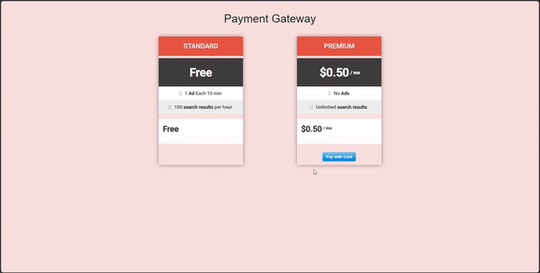

# Stripe Payment Gateway

Stripe is a popular payment processing platform that allows businesses and individuals to accept payments over the internet. It provides a set of APIs and tools that enable developers to integrate payment processing into websites and mobile applications easily.

Stripe acts as a payment gateway, allowing businesses to securely process credit card payments and other forms of online payments, such as Apple Pay and Google Pay.

To create a Stripe gateway for payment processing, you need to sign up in stripe and get the access keys. Then you need to insert the keys in setting.ini file. 

NB: The payment fee is adjustable in app.py file.
